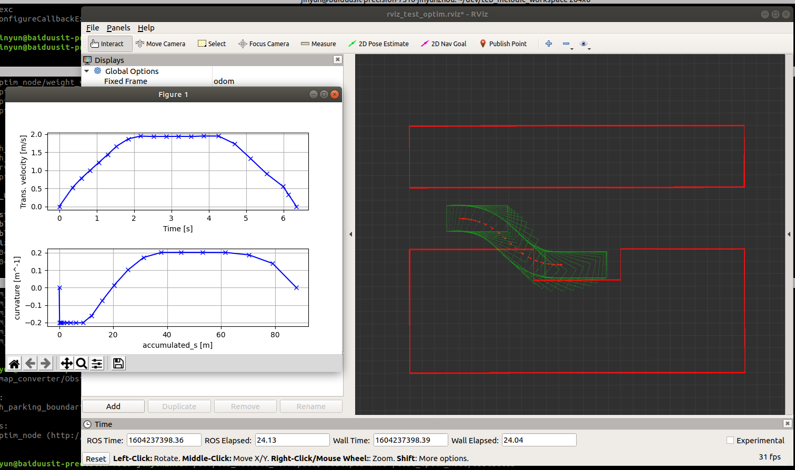
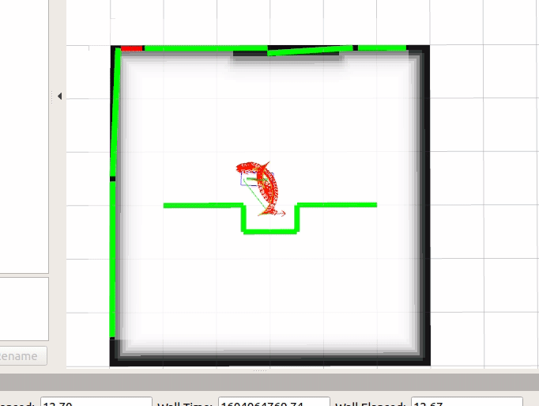

# teb_melodic_workspace

**Dependencies:**

 * Melodic ROS
 * *navigation stack* and *teb_local_planner* package in melodic version
 * *stage* package in melodic version
 * a few python dependency like numpy, matplotlib

**Testing_procedures:**
1. run "catkin_make" in this folder
2. run "source /opt/ros/melodic/setup.bash" and "source devel/setup.bash" in every terminal used, better have it in your bashrc
3. run "roslaunch teb_local_planner test_optim_node.launch", and here we go

**Note:**
TEB is local planner. When testing it alone without a simulation environment like "stage", The TEB is using start-to-end straight line as the local optimization initials by default, thus obstacle collision failure could happen in below setups, will add a global planner soon

**TODO:**
1. [Done]Setup env with perfect localization and perception
2. [Done]Visualize the obstacle
3. [Done]Setup configuration accordng to paper experiment setups
4. [Done]Testing script on curvature performance
5. Use better global planner
6. Testing on time performance

**Archived Test Setup:**
1. With ros-state simulation env run "roslaunch teb_local_planner_testing robot_carlike_in_stage.launch", and here we go (Clearly, Teb is doing crazy here because the inaccurate and jumpping localization and perception)

