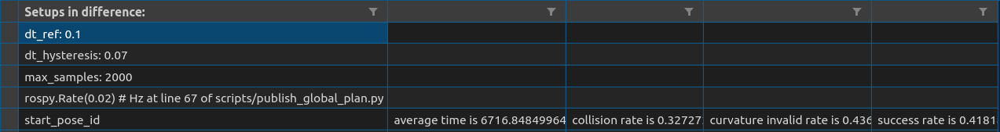
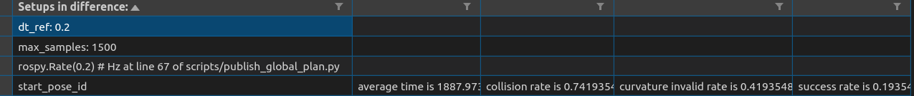
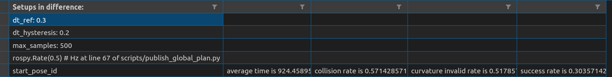
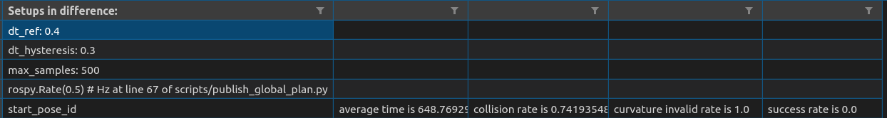
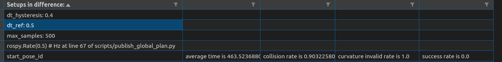
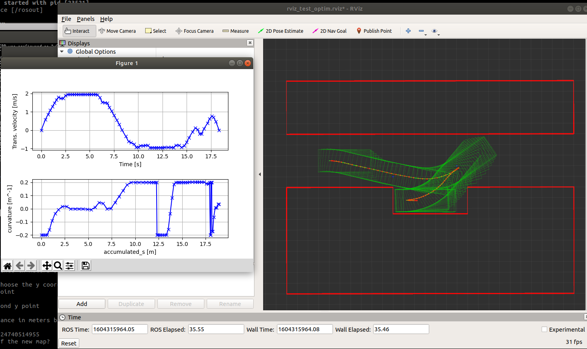

# teb_melodic_workspace

**Dependencies:**

 * Melodic ROS (http://wiki.ros.org/melodic/Installation/Ubuntu)
 * Add current folder into ros package folder. `export ROS_PACKAGE_PATH=/home/YOUR_PATH/src/:/opt/ros/melodic/share`
 * *navigation stack* package in melodic version `sudo apt-get install ros-melodic-navigation`
 * *stage* package in melodic version `sudo apt-get install ros-melodic-stage-ros`
 * Install teb local planner `sudo apt-get install ros-melodic-teb-local-planner`
 * Run `source /opt/ros/melodic/setup.bash`
 * *teb dependency*:  `rosdep install teb_local_planner`
 * a few python dependency like numpy, matplotlib

**Testing_procedures:**
1. run "catkin_make" in this folder
2. run "source /opt/ros/melodic/setup.bash" and "source devel/setup.bash" in every terminal used, better have it in your bashrc
3. ~~adapt "DATA_PATH" at line 11 in scripts/publish_global_plan.py to your own absolute path~~
4. ~~adapt "RESULTS_TABLE_CSV" at line 19 in scripts/subsribe_feedback.py to your own absolute path~~
3. please upload your global plan results to under `global_planner/data/hybrid_star_results`
4. expected results saved in `teb_local_planner/scripts/test_results.csv`
5. run "roslaunch teb_local_planner test_optim_node.launch"
6. when you see "all global plan published" shown in your terminal. Ctrl-C to stop the terminal. And statistics will be automaticaly dumped at RESULTS_TABLE_CSV. Read it in csv reader is recommended.
7. If you want to change or update the data in DATA_PATH, please update line 27-28 in scripts/publish_global_plan.py accordingly

Below results is by the config in cfg/carlike_teb_local_planner_params.yaml except a few different confs mentioned in the image








**Parameter Tuning**

```
rosrun rqt_reconfigure rqt_reconfigiture
```

**TODO:**
1. ~~[Done]Setup env with perfect localization and perception without ros-stage~~
2. ~~[Done]Visualize the obstacle~~
3. ~~[Done]Setup configuration accordng to paper experiment setups~~
4. ~~[Done]Testing script on curvature performance~~
5. ~~[Done]Single starting position testing setup finished for curvature and time consumption benchmark with man-feed global plan by "Via points"(the blue dots on the graph)~~
6. ~~[Done]Muliple starting position testing,
    a. Awaiting integration of global planner (make map, dive deep into code to integrate tf, map_server, costmap2d and global planner)
    b. Or switching back to ros-stage simulator(resetup the configuration, get rid of noise of perception and localization error, write a script to send start and goal pose, write a script to capture the very first frame of planning trajectory(as ros-stage will drive the car to goal, thus changing the "start" position setups))~~
7. ~~[Done]Fix global planning subsriber missing messages~~
8. ~~[Done]Conducting tests on different dt[0.1, 0.2, 0.3, 0.4, 0.5] with fined tuned parameters~~
9. Aligning testing setups with other optimizers

**Archived Test Setup:**
1. With ros-state simulation env run "roslaunch teb_local_planner_testing robot_carlike_in_stage.launch", and here we go (Clearly, Teb is doing crazy here because the inaccurate and jumpping localization and perception)


2. With self-constructed env inspired by original test_optim_node.cpp which is pure test setup for the planner only.
Note: TEB is local planner. When testing it alone without a simulation environment like "stage", The TEB is using start-to-end straight line as the local optimization initials by default, thus obstacle collision failure could happen in below setups, will add a global planner soon


3.[Deprecated]Single stating point running mode by run "roslaunch teb_local_planner test_optim_node.launch". Two blue dots as Via points serve as a rough global plan. The blue points is harded-coded, only for the starting point in the grap below
**TEB is doing fine on curvature below with computation time of 50ms with dt=0.3**

